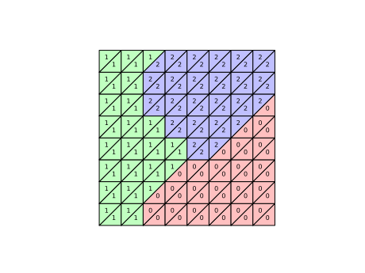
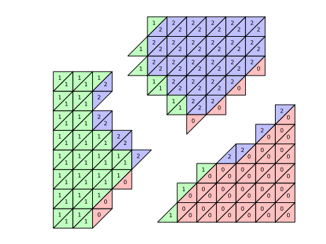
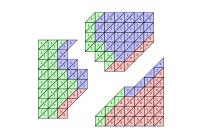

Parallel Mesh handling in DOLFIN
================================

When running DOLFIN in parallel, the Mesh is partitioned and distributed between
processes. Normally, this is done by calling a third-party library on a graph of
the cell-cell connectivity, in order to get a good load balance.
For example, the resulting cell partition on three processes for a simple 2D mesh
would look like this:

Every cell has been assigned to a process (0, 1 or 2). Note that there are some
vertices (and also edges) which are now *shared* between processes.
DOLFIN makes the sharing information of mesh entities (such as vertices, facets, etc.)
available with the function ``mesh.topology.shared_entities(dim)``
which returns a map from the local entity index to the set of processes that share that entity.

Ghost Meshes
------------

In some applications, it is necessary or advantageous to also share
some cells, as well as other entities between processes. In DOLFIN,
this is performed at Mesh construction time by a ``GhostMode``
parameter. Currently, this can be ``none``, ``shared_facet`` or
``shared_vertex``. Selecting ``GhostMode.none`` results in the usual
behaviour (as above). The following diagram shows the cell distribution for
``shared_facet`` mode with the same mesh. Any inter-process boundaries are
extended by one cell, sharing a facet with an existing cell on that
process.

Likewise, for ``shared_vertex`` mode, any cell on another process which
shares a vertex with a local cell is added to the mesh.

Ghost Cells
^^^^^^^^^^^

In both cases, we now have "shared cells" as well as a lot more shared
vertices, edges etc. Unlike lower dimension entities, cells have a
specific "owning process", and the shared cells which are not owned
by the local process are designated as "ghost cells". Ghost cells are
kept at the end of the list of cells on a process.

.. code-block::

            --- Cell Index -->
    Owned:  xxxxxxxxxxxxx
    Shared: x   x      x xxxxx
    Ghost:               xxxxx

Note that all ghost cells are shared, (possibly with multiple
processes), and that shared cells may be either owned or ghost.
The total number of local cells (normal + ghost) on a process can be
obtained with ``mesh.topology.size(tdim)``, where ``tdim`` is the
topological dimension of the mesh. The position where ghost cells start is given
by ``mesh.topology.ghost_offset(tdim)`` and this is equivalent to the
local number of normal (non-ghost) cells. The number of ghost cells is
difference of these two numbers. Normal, non-ghost cells are owned
locally by definition. The ownership of the ghost cells can be
obtained with the ``mesh.topology.cell_owner()`` function, which
returns a list with the owning process number for each ghost cell.

Ghost Entities
^^^^^^^^^^^^^^
Extending the mesh by adding ghost cells also involves sharing more
vertices, edges, and faces (if in 3D). Like ghost cells, these extra
entities are appended at the end of the list of entities on each
process. An entity is a "ghost entity" if it only appears in a "ghost
cell", and does not appear in a regular cell on that process.
As for ghost cells, the functions ``mesh.topology.size(dim)`` and
``mesh.topology.ghost_offset(dim)`` perform a similar function.
There is no concept of ownership for lower dimension entities, but in
cases where discrimination is necessary, the lowest rank sharing
process may take precedence.
